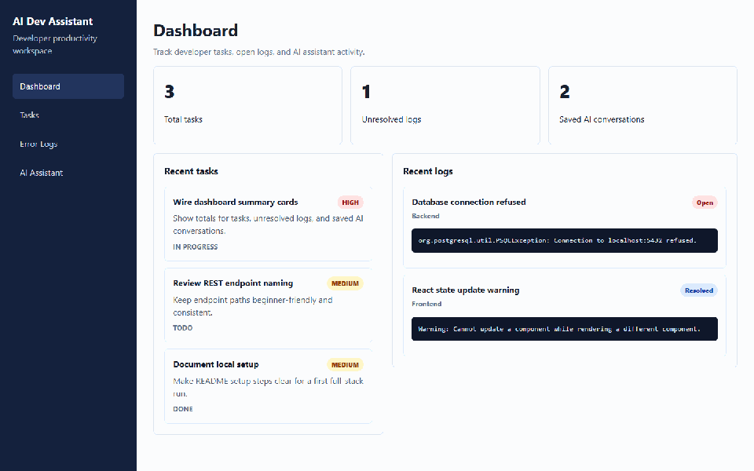
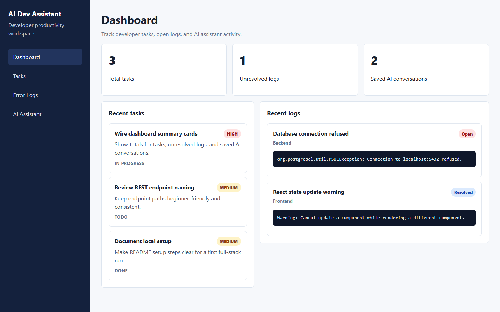
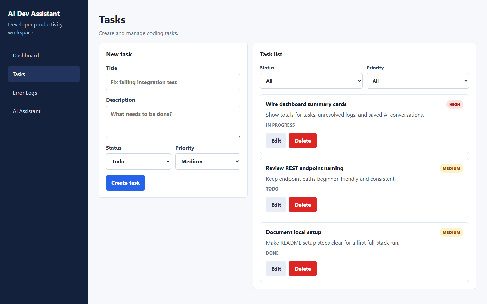
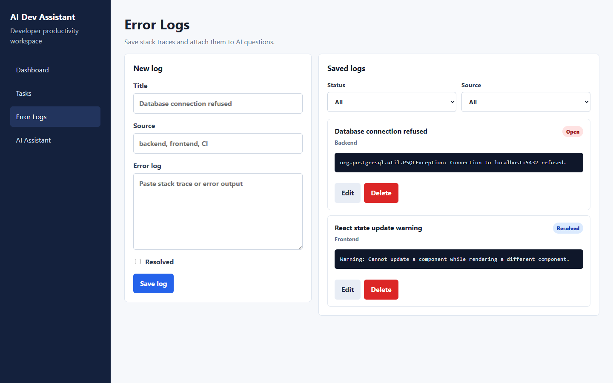
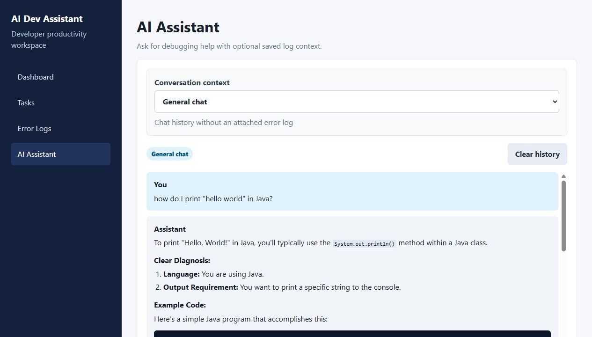

# AI Dev Assistant Dashboard

[](https://github.com/iman2001-ie/ai-dev-assistant-dashboard/actions/workflows/ci.yml)

A full-stack developer productivity dashboard for tracking coding tasks, saving error logs, and asking an AI assistant for debugging help.

This project is intentionally small enough to learn from, but structured like a real application: a React frontend, a Spring Boot REST API, PostgreSQL persistence, database migrations, and an optional OpenAI-powered assistant.

## Features

- Dashboard summary for tasks, unresolved logs, and assistant activity
- Task management with status and priority filters
- Error log storage with source and resolved/open filters
- AI assistant chat with separate histories for general chat and each saved error log
- Markdown rendering for assistant responses
- Mock assistant responses when no OpenAI API key is configured
- PostgreSQL schema management with Flyway migrations

## Demo

The app currently runs locally. The walkthrough below uses sample development data to show task creation, task editing, error log tracking, and an AI-assisted debugging chat.



## Screenshots

| Dashboard | Tasks |
| --- | --- |
|  |  |

| Error Logs | AI Assistant |
| --- | --- |
|  |  |

## Tech Stack

- Frontend: React, TypeScript, Vite, React Router
- Backend: Java 21, Spring Boot, Spring Web, Spring Data JPA
- Database: PostgreSQL
- Migrations: Flyway
- AI: OpenAI API, optional
- Styling: CSS

## Project Structure

```text
ai-dev-assistant-dashboard/
  backend/                 Spring Boot REST API
  frontend/                React + TypeScript app
  docs/                    Additional development notes
  scripts/                 Local helper scripts
  docker-compose.yml       Recommended local PostgreSQL service
  README.md
```

## Getting Started

### Prerequisites

- Java 21
- Maven 3.9+
- Node.js 20+
- npm
- Docker Desktop

### Quick Start

From the project root:

```powershell
.\scripts\start-dev.ps1
```

Then open:

```text
http://127.0.0.1:5173
```

The script starts PostgreSQL with Docker Compose, starts the Spring Boot backend, and starts the Vite frontend.

To stop the local stack:

```powershell
.\scripts\stop-dev.ps1
```

To check what is running:

```powershell
.\scripts\status-dev.ps1
```

### Manual Setup

If you prefer to run each service yourself, use the commands below.

### 1. Start PostgreSQL

This project uses Docker Compose as the recommended local database setup. It keeps the app's PostgreSQL version, database name, username, and password consistent across machines.

```bash
docker compose up -d
```

This starts PostgreSQL on `localhost:5432` using the local development credentials from `docker-compose.yml`.

### 2. Start the Backend

```bash
cd backend
mvn spring-boot:run
```

The API runs at:

```text
http://localhost:8080
```

### 3. Start the Frontend

```bash
cd frontend
npm install
npm run dev
```

The app runs at:

```text
http://localhost:5173
```

## Optional AI Setup

The app works without an OpenAI API key. If `OPENAI_API_KEY` is not set, the backend returns mock assistant responses for local development.

To enable real AI responses, set:

```bash
OPENAI_API_KEY=your_api_key
OPENAI_MODEL=gpt-4o-mini
```

For local development, copy `.env.example` to `.env.local` and put private values there. `.env.local` is ignored by Git.

## API Overview

Base URL:

```text
http://localhost:8080/api
```

Main endpoints:

- `GET /dashboard/summary`
- `GET /tasks`
- `POST /tasks`
- `PUT /tasks/{id}`
- `DELETE /tasks/{id}`
- `GET /logs`
- `POST /logs`
- `PUT /logs/{id}`
- `DELETE /logs/{id}`
- `POST /chat`
- `GET /chat/history?noContext=true`
- `GET /chat/history?errorLogId={id}`
- `DELETE /chat/history?noContext=true`
- `DELETE /chat/history?errorLogId={id}`

Example chat request:

```json
{
  "message": "Can you help me understand this error?",
  "errorLogId": 1
}
```

## Development Notes

More detailed setup notes and agent-specific instructions live outside the public README:

- [Local development notes](docs/LOCAL_DEVELOPMENT.md)
- [Secrets and API keys](docs/SECRETS.md)
- [Agent instructions](AGENTS.md)

## Roadmap

- Authentication and per-user data
- Task due dates and tags
- Conversation grouping for assistant chats
- Streaming AI responses
- More backend service and controller tests
- Production Dockerfiles for frontend and backend
- Richer assistant tool traces

## License

No license has been selected yet.
