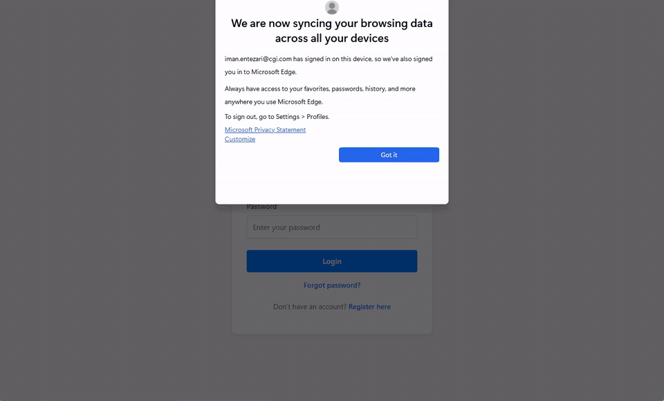
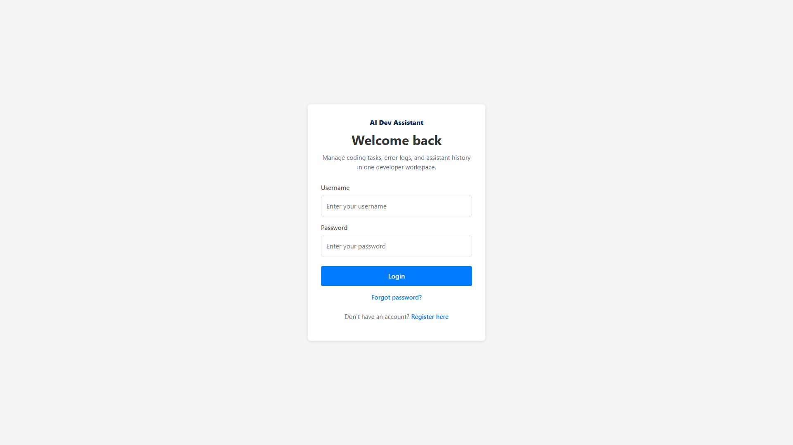
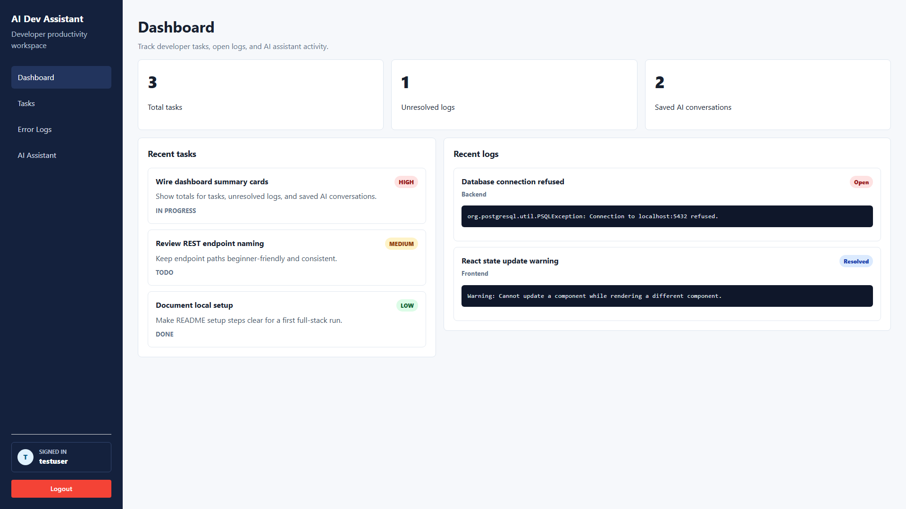
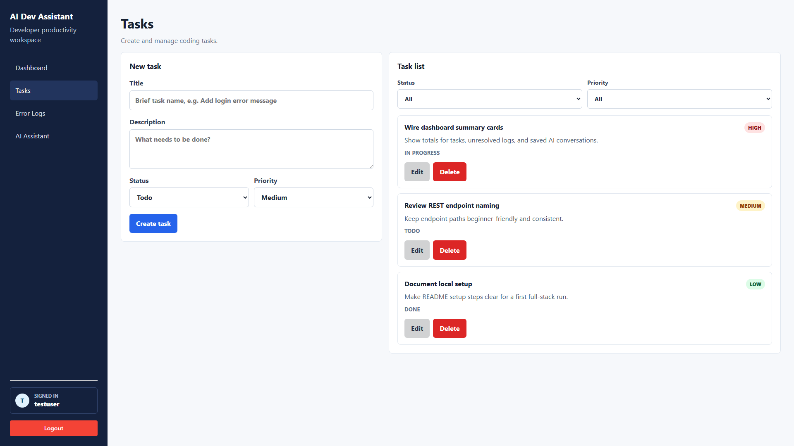
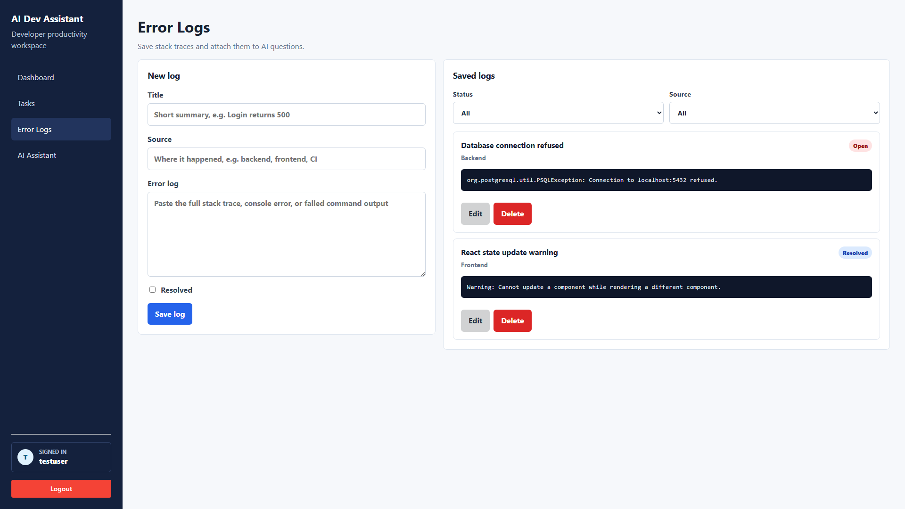
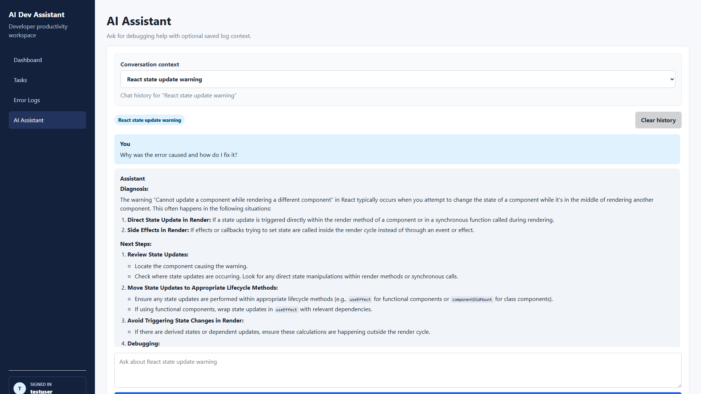
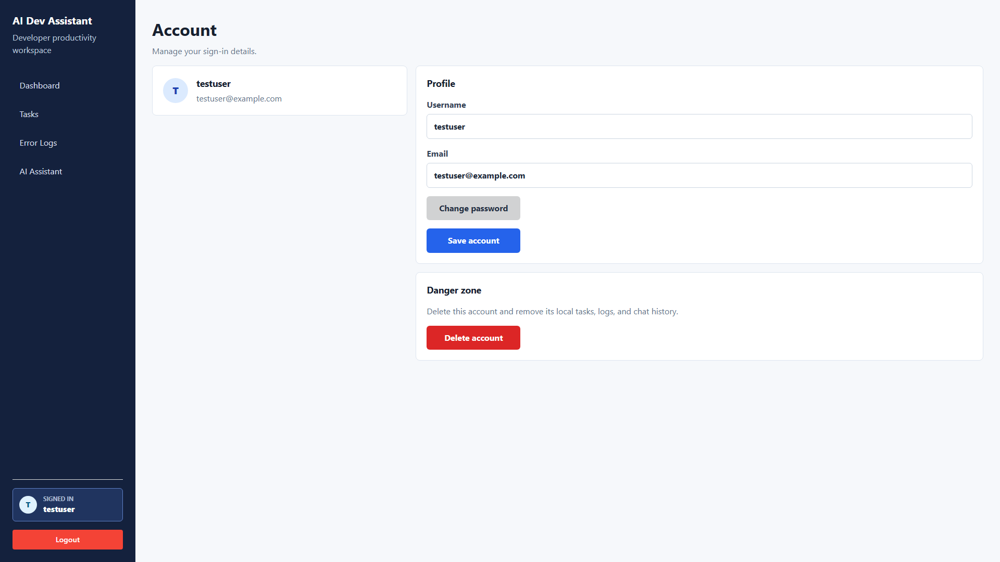

# AI Dev Assistant Dashboard

[](https://github.com/iman2001-ie/ai-dev-assistant-dashboard/actions/workflows/ci.yml)

A full-stack developer productivity dashboard for tracking coding tasks, saving error logs, and asking an AI assistant for debugging help.

This project is intentionally small enough to learn from, but structured like a real application: a React frontend, a Spring Boot REST API, PostgreSQL persistence, Flyway migrations, JWT authentication, local development scripts, and GitHub CI.

## Current Status

The app is a working local MVP. Users can register, log in, manage their account, create private tasks and error logs, and chat with the assistant in either a general context or attached to a saved error log.

The assistant works without an OpenAI API key by returning mock responses. If `OPENAI_API_KEY` is configured, the backend can call OpenAI from the server side.

## Features

- Username/password registration and login
- JWT access tokens with server-side refresh tokens
- Protected frontend routes and logout
- Account profile editing with current-password verification for password changes
- Account deletion with confirmation
- Per-user task, error-log, and chat-history isolation
- Dashboard summary for tasks, unresolved logs, and assistant activity
- Task management with status and priority filters
- Error log storage with source and resolved/open filters
- AI assistant chat with separate histories for general chat and each saved error log
- Markdown rendering for assistant responses
- Mock assistant responses when no OpenAI API key is configured
- PostgreSQL schema management with Flyway migrations
- GitHub Actions CI for backend tests, frontend lint, and TypeScript checks

## Demo

The app currently runs locally. The walkthrough below uses sample development data to show task creation, task editing, error log tracking, and an AI-assisted debugging chat.



## Screenshots

| Login | Dashboard |
| --- | --- |
|  |  |

| Tasks | Error Logs |
| --- | --- |
|  |  |

| AI Assistant | Account |
| --- | --- |
|  |  |

## Tech Stack

- Frontend: React, TypeScript, Vite, React Router
- Backend: Java 21, Spring Boot, Spring Web, Spring Security, Spring Data JPA
- Database: PostgreSQL
- Migrations: Flyway
- Auth: JWT access tokens, opaque refresh tokens, BCrypt password hashing
- AI: OpenAI API, optional server-side integration
- CI: GitHub Actions
- Styling: CSS

## Project Structure

```text
ai-dev-assistant-dashboard/
  backend/                 Spring Boot REST API and Flyway migrations
  frontend/                React + TypeScript app
  docs/                    Contributor docs, screenshots, and demo assets
  scripts/                 Local PowerShell helper scripts
  _bmad-output/            BMAD planning and sprint artifacts
  _bmad/                   BMAD configuration and workflow support
  .agents/                 Installed BMAD agent/skill definitions
  .github/                 GitHub Actions and BMAD GitHub agent definitions
  docker-compose.yml       Local PostgreSQL service
  README.md
```

## Getting Started

### Prerequisites

- Java 21
- Maven 3.9+
- Node.js 20+
- npm
- Docker Desktop
- PowerShell, recommended on Windows

### Quick Start

From the project root:

```powershell
.\scripts\start-dev.ps1
```

Then open:

```text
http://127.0.0.1:5173
```

The script starts PostgreSQL with Docker Compose, starts the Spring Boot backend, and starts the Vite frontend.

To stop the local stack:

```powershell
.\scripts\stop-dev.ps1
```

To check what is running:

```powershell
.\scripts\status-dev.ps1
```

## Local Login

You can register a new account through the UI, or create the default local development user after the backend is running:

```powershell
.\scripts\create-dev-user.ps1
```

Default local credentials:

```text
Username: testuser
Password: Password123!
```

Login uses the username, not the email address.

The helper script also claims any unowned sample tasks, logs, and chat messages for that user so demo data is visible without being shared across every account.

## Manual Setup

If you prefer to run each service yourself, use the commands below.

### 1. Start PostgreSQL

```bash
docker compose up -d
```

This starts PostgreSQL on `localhost:5432` using the local development credentials from `docker-compose.yml`.

### 2. Start the Backend

```bash
cd backend
mvn spring-boot:run
```

The API runs at:

```text
http://localhost:8080
```

### 3. Start the Frontend

```bash
cd frontend
npm install
npm run dev
```

The app runs at:

```text
http://localhost:5173
```

## Reset Local Data

For a clean local Docker database:

```powershell
.\scripts\reset-dev-db.ps1
.\scripts\start-backend.ps1
.\scripts\create-dev-user.ps1
```

`reset-dev-db.ps1` deletes only the Docker PostgreSQL volume for this project. It does not delete `.env.local`, source files, or Git history.

## Optional AI Setup

The app works without an OpenAI API key. If `OPENAI_API_KEY` is not set, the backend returns mock assistant responses for local development.

To enable real AI responses, set:

```bash
OPENAI_API_KEY=your_api_key
OPENAI_MODEL=gpt-4o-mini
```

For local development, copy `.env.example` to `.env.local` and put private values there. `.env.local` is ignored by Git.

## API Overview

Base URL:

```text
http://localhost:8080/api
```

Main endpoints:

- `POST /auth/register`
- `POST /auth/login`
- `POST /auth/refresh`
- `POST /auth/logout`
- `GET /auth/me`
- `PUT /auth/me`
- `DELETE /auth/me`
- `POST /dev/claim-seed-data`
- `GET /dashboard/summary`
- `GET /tasks`
- `POST /tasks`
- `PUT /tasks/{id}`
- `DELETE /tasks/{id}`
- `GET /logs`
- `POST /logs`
- `PUT /logs/{id}`
- `DELETE /logs/{id}`
- `POST /chat`
- `GET /chat/history?noContext=true`
- `GET /chat/history?errorLogId={id}`
- `DELETE /chat/history?noContext=true`
- `DELETE /chat/history?errorLogId={id}`

Protected endpoints require:

```text
Authorization: Bearer <access-token>
```

Example chat request:

```json
{
  "message": "Can you help me understand this error?",
  "errorLogId": 1
}
```

## Development Workflow

This project was developed over a focused one-week learning sprint. The starting point was a mostly non-functional full-stack app shell. The work progressed through:

- Restoring the local development stack and scripts
- Adding database migrations for users and ownership
- Implementing backend auth endpoints, JWT handling, refresh, and logout
- Adding frontend login, registration, protected routes, and clearer auth errors
- Fixing CORS and authenticated API calls from the Vite frontend
- Isolating tasks, error logs, and chat history per user
- Adding local reset and dev-user scripts
- Adding account profile editing and account deletion
- Hardening error-log deletion when chat history is attached
- Updating CI and focused backend/frontend checks

Agentic coding was used as the main implementation style: the assistant inspected the codebase, proposed small changes, edited files, ran tests, reviewed failures, and iterated with the user through real browser and backend behavior. The workflow stayed intentionally pragmatic: fix the current broken path, verify it locally, commit, push, and document what changed.

BMAD was used for planning and structure. Sprint planning converted the initial ticket list into epics and stories under `_bmad-output/`, while BMAD story and review workflows helped track authentication decisions, implementation status, review findings, and deferred work. The checked-in BMAD files are part of the project history and show how agent-assisted planning guided the sprint.

## Verification

Run the same checks used in CI:

```powershell
.\scripts\run-tests.ps1
```

Or run them manually:

```bash
cd backend
mvn test
```

```bash
cd frontend
npm run lint
npx tsc -b
```

## Documentation

- [Documentation index](docs/index.md)
- [Local development notes](docs/LOCAL_DEVELOPMENT.md)
- [Authentication decision](docs/auth-decision.md)
- [Secrets and API keys](docs/SECRETS.md)
- [Project overview](docs/project-overview.md)
- [Sprint 1 task tracker](docs/sprint1-tasks.md)
- [Agent instructions](AGENTS.md)

## Roadmap

- Refresh README demo assets and screenshots
- Add task due dates and tags
- Improve assistant conversation grouping
- Add streaming AI responses
- Add smoke E2E tests for core authenticated flows
- Add production Dockerfiles for frontend and backend
- Add richer assistant tool traces
- Revisit frontend token storage and production auth hardening

## License

No license has been selected yet.
